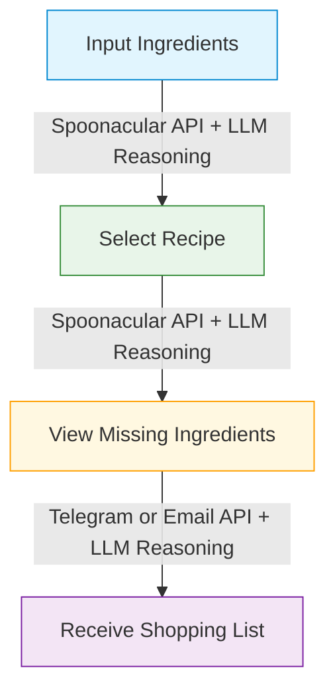
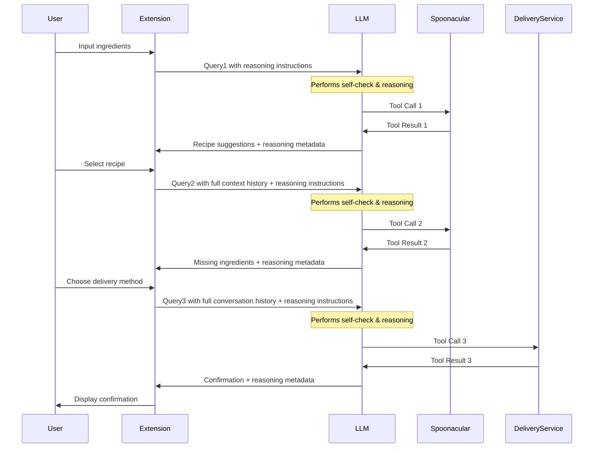
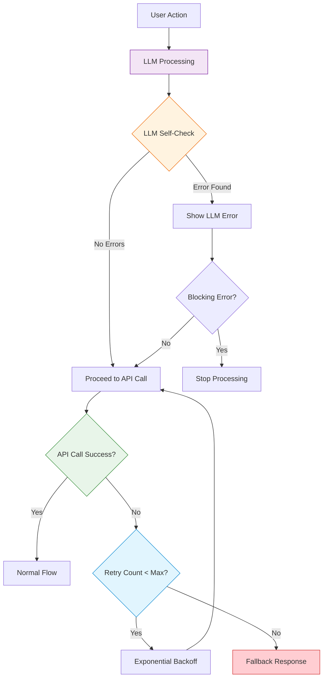

# Recipe Suggester and Shopping List Generator Chrome Plugin

This Chrome extension harnesses the power of multi-step agentic workflows with structured reasoning to help you discover recipes based on ingredients you already have and generate shopping lists for any missing items.


## Table of Contents
- [Features](#features)
- [Installation](#installation)
- [How It Works](#how-it-works)
- [API Configuration](#api-configuration)
- [Advanced Reasoning Capabilities](#advanced-reasoning-capabilities)
- [Workflow Diagrams](#workflow-diagrams)
- [Technical Architecture](#technical-architecture)
- [Development](#development)
- [Limitations](#limitations)
- [License](#license)

## Features

- 🔍 **Ingredient-Based Recipe Search**: Find recipes based on what's already in your kitchen
- 📋 **Automatic Missing Ingredient Detection**: Identify what you need to buy
- 📱 **Multi-Channel Delivery**: Send shopping lists via Telegram or Email
- 🧠 **Multi-Step Agentic Workflow**: Maintains context between steps for a coherent experience
- 🤔 **Explicit Reasoning & Self-Checks**: AI-powered verification at each step
- 🧩 **Reasoning Type Awareness**: Identifies different reasoning styles (logical, creative, etc.)
- 🛡️ **Robust Error Handling**: Multiple fallback mechanisms and detailed error messages
- 🔄 **Conversation Loop Support**: Maintains comprehensive context across workflow steps
- 🚧 **Graceful Degradation**: Falls back to simulated responses when APIs or LLM are unavailable
- 🔒 **Secure API Key Management**: Store your API keys securely in Chrome's sync storage

## Installation

### From Source
1. Clone this repository or download the ZIP file
2. Open Chrome and navigate to `chrome://extensions/`
3. Enable "Developer mode" using the toggle in the top right
4. Click "Load unpacked" and select the directory containing the extension files
5. The Recipe Suggester icon should now appear in your Chrome toolbar

## How It Works

The plugin utilizes a 4-step process with intelligent reasoning at each stage:



### Step 1: Input Your Ingredients
Enter ingredients you have available, separated by commas. The LLM performs a self-check on the ingredients, validating them before searching for appropriate recipes.

### Step 2: Select a Recipe
Browse suggested recipes that use your available ingredients. The LLM maintains context from step 1 and incorporates it into reasoning.

### Step 3: View Missing Ingredients
See what additional items you need to buy. The LLM analyzes the missing ingredients and prepares them for delivery using structured reasoning.

### Step 4: Receive Your Shopping List
Get your shopping list delivered via your preferred method with appropriate formatting and context.

## API Configuration

This extension requires the following API keys:

- **Gemini API**: For LLM-powered reasoning and decision-making
- **Spoonacular API**: For recipe suggestions and ingredient analysis
- **Telegram Bot API** or **SendGrid API**: For delivering shopping lists

To configure your API keys:
1. Click the gear icon (⚙️) in the top-right corner of the extension popup
2. Enter your API keys in the designated fields
3. Click "Save Configuration"

### Free API Tiers
- **Gemini API**: Free tier available with limits
- **Spoonacular API**: 150 requests/day on the free tier
- **Telegram Bot API**: Free for all usage
- **SendGrid API**: 100 emails/day on the free tier

## Advanced Reasoning Capabilities

### Explicit Reasoning Instructions
The extension prompts the LLM to think step-by-step about each request, breaking down the problem into components and explaining the reasoning process.

### Reasoning Type Awareness
The LLM identifies different reasoning types needed for each subtask:

- **ARITHMETIC**: For calculations and numeric operations
- **RETRIEVAL**: For looking up specific facts or data
- **COMPARISON**: For comparing multiple options
- **LOGICAL**: For deductive or inductive reasoning
- **CAUSAL**: For cause-and-effect analysis
- **ANALOGICAL**: For drawing parallels
- **CREATIVE**: For generating new ideas
- **SOCIAL**: For understanding user intentions

### Internal Self-Checks
Before proceeding with each step, the LLM performs a self-check to verify:

- Input validity
- Context retention
- Tool selection appropriateness
- Data consistency

Example from code:
```javascript
// Self-check for recipe selection stage
function buildReasoningPrompt(query, stage) {
  // ... other code ...
  if (stage === 2) {
    reasoningPrompt += `
    IMPORTANT: After your initial analysis, please perform a SELF-CHECK with these verification steps:
    1. Verify you have correctly identified the selected recipe title and ID from the previous step/context.
    2. Confirm you have the list of user's available ingredients from the previous step/context.
    3. Validate that the next logical step is to get the selected recipe's *required* ingredients.
    // ... and more
`;
  }
  // ... other code ...
}
```

### Uncertainty and Error Handling
The LLM explicitly marks uncertainties and errors using tagged notation:
- `[UNCERTAINTY: X]` - Marks areas where the LLM has partial confidence
- `[ERROR: X]` - Flags critical issues that need attention

### Structured Output Format
All LLM responses follow a consistent format with clearly labeled reasoning types, self-checks, uncertainties, and errors, making the reasoning process transparent and debuggable.

## Workflow Diagrams

### Enhanced Multi-Step Agentic Workflow
Each step maintains deep context from previous interactions with reasoning metadata:



### Enhanced Error Handling Flow



## Technical Architecture

### Files Structure
- `manifest.json`: Extension configuration
- `popup.html`: Main user interface
- `styles.css`: UI styling
- `popup.js`: Core functionality, reasoning engine and API interactions
- `background.js`: Background processes and message handling

### Enhanced State Management
The extension maintains a comprehensive conversation history with reasoning metadata:

```javascript
let conversationHistory = {
    query1: '',             // Initial user query with ingredients
    llmResponse1: '',       // LLM's response to query1
    toolCall1: '',          // First API call details
    toolResult1: '',        // Results from first API call
    query2: '',             // Second query including recipe selection
    llmResponse2: '',       // LLM's response to query2
    toolCall2: '',          // Second API call details
    toolResult2: '',        // Results from second API call
    query3: '',             // Third query with delivery method
    llmResponse3: '',       // LLM's response to query3
    toolCall3: '',          // Third API call details
    toolResult3: '',        // Results from third API call
    finalResult: '',        // Final delivery confirmation
    // Reasoning metadata
    selfCheck1: '',         // Self-check results for step 1
    selfCheck2: '',         // Self-check results for step 2
    selfCheck3: '',         // Self-check results for step 3
    reasoningTypes1: [],    // Reasoning types used in step 1
    reasoningTypes2: [],    // Reasoning types used in step 2
    reasoningTypes3: [],    // Reasoning types used in step 3
    error1: '',             // LLM-identified errors in step 1
    error2: '',             // LLM-identified errors in step 2
    error3: '',             // LLM-identified errors in step 3
    uncertainty1: '',       // LLM-identified uncertainties in step 1
    uncertainty2: '',       // LLM-identified uncertainties in step 2
    uncertainty3: '',       // LLM-identified uncertainties in step 3
    retryCount1: 0,         // Number of LLM retry attempts in step 1
    retryCount2: 0,         // Number of LLM retry attempts in step 2
    retryCount3: 0          // Number of LLM retry attempts in step 3
};
```

### Retry and Fallback Mechanisms
The extension implements sophisticated retry and fallback logic:

1. **LLM Retries**: Multiple attempts with exponential backoff for LLM API calls
2. **API Retries**: Multiple attempts with backoff for external API calls
3. **Fallback Response Generation**: When LLM is unavailable, provides context-aware simulated responses
4. **Fallback Ingredients**: Generates plausible ingredients when recipe API fails
5. **Non-Blocking vs. Blocking Errors**: Differentiates between critical and non-critical issues

## Development

### Prerequisites
- Chrome browser
- Basic knowledge of HTML, CSS, and JavaScript
- API keys for Gemini, Spoonacular, Telegram and/or SendGrid

### Modifying the Extension
1. Update the files as needed
2. Reload the extension in `chrome://extensions/` after making changes

### Adding Features
The extension is designed with modularity in mind:
- Add new delivery methods by extending the delivery options in `popup.html` and the corresponding handlers in `popup.js`
- Implement additional recipe filters by extending the Spoonacular API calls
- Enhance reasoning instruction templates in the `buildReasoningPrompt` function

## Limitations

- Recipe suggestions are limited by the Spoonacular API's capabilities
- Free API tiers have daily request limits
- Gemini API may have occasional downtime or rate limits
- Ingredient matching logic between recipe requirements and user ingredients may not be perfect

## License

MIT License - See LICENSE file for details.

---

*This Chrome extension was created as a demonstration of multi-step agentic workflows with structured reasoning. It showcases how LLMs can maintain context across multiple interactions while leveraging external tools to solve complex problems.*